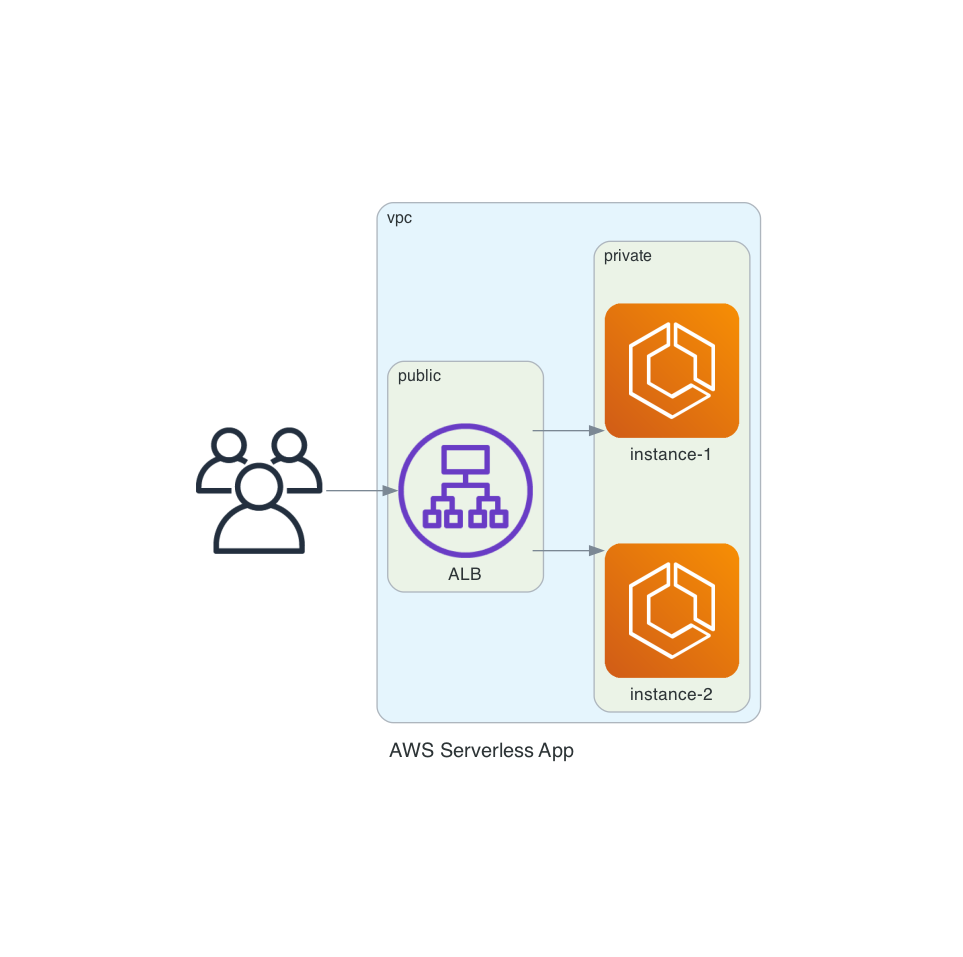
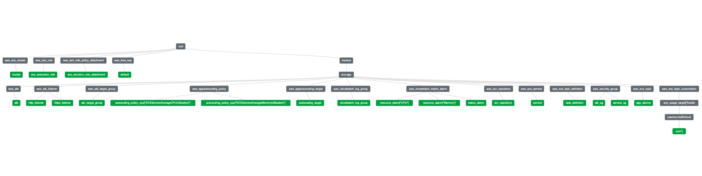

# AWS Serverless app

> Application is (currently) available - http://demo-api-2067803618.eu-central-1.elb.amazonaws.com/hello-world

This project contains two main parts:
- `app` - simple FastAPI Python application
- `infra` - terraform resources for provisioning infrastructure for serverless hosting of the `app`

## How to run application locally

Application is meant to be run in container so running it is easy.

You need to build Docker image (on `amd64` architecture):
```
docker build -t demo-api app
```
To run the application use following command:
```
docker run -p 80:80 demo-api
```
Test if the application is running with call to the hello world endpoint:
```
curl http://localhost/hello-world
```
> You can also test the application via Swagger - http://localhost/docs

## Infrastructure

In the `infra` folder you can find all of the infrastructure described using Terraform.

There is separate module `infra/modules/ecs-app` which contains all resources that are specific to the application itself. While the other resources in the `infra` folder are global (for example: roles and vpc).

Before running any terraform commands in the `infra` directory you'll need to edit (or delete) `backend.tf`. It is now set to my own `s3_bucket` and `dynamodb_table` which won't work for anybody expect me (and the pipeline). You can also change `provider.tf` as you wish.

Simple `terraform apply` will create all necessary resources. In the end of the command output you'll see terraform output `application_hostname`. That is the value you'll use to access application via network - `http://${application_hostname}/hello-world`.

Now you have all infrastructure up and running, but there is one thing missing - docker image on the ECR repository. You'll need to upload the image you build in the step before.
```
$ REPOSITORY_URL="${AWS_ACCOUNT_ID}.dkr.ecr.${AWS_REGION}.amazonaws.com"
$ aws ecr get-login-password --region ${AWS_REGION} | docker login --username AWS --password-stdin "${REPOSITORY_URL}"
$ docker tag demo-api:latest "${REPOSITORY_URL}/demo-api:latest"
$ docker push "${REPOSITORY_URL}/demo-api:latest"
```

Now you need to wait for image to be pulled in the ECS. After passing health check it will be available.

## Pipelines

There are two main pipelines (GitHub Actions). One for the `app` and one for the `infra`. Both have two variants: one for the commit in the `master` branch and one for the commit in the `pull_request`.

All workflows use OpenID Connect to authenticate with the AWS. So there are no credentials stored in the project itself. Which is important for terraform pipeline given the permissions it has.

| workflow | description |
|---|---|
| app-build | It has all jobs for lint, test and build of the application |
| app-pr | It uses `app-build` and is active only in `pull_request` |
| app-main | It uses `app-build` and adds additional jobs (`publish`, `deploy`), it is active only on push to `master` |
| infra-test | It has job for static analysis of terraform code |
| infra-pr | It uses `infra-test` and adds `plan` job for outputting changes to the infrastructure in the `pull_request` |
| infra-main | It uses `infra-test` and adds `apply` job for provisioning infrastructure automatically on the AWS |  

## Graphs


*Simple networking graph*


*Graph of all resources (excluding the VPC module)*